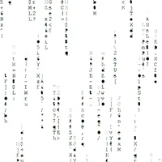

<!-- ### Hi there 👋 -->

<!--
**hongda3141/hongda3141** is a ✨ _special_ ✨ repository because its `README.md` (this file) appears on your GitHub profile.

Here are some ideas to get you started:

- 🔭 I’m currently working on ...
- 🌱 I’m currently learning ...
- 👯 I’m looking to collaborate on ...
- 🤔 I’m looking for help with ...
- 💬 Ask me about ...
- 📫 How to reach me: ...
- 😄 Pronouns: ...
- ⚡ Fun fact: ...
-->

  

  
  
  

<h1>
  hey there
  
</h1>

  

---

### :technologist: About Me :

I am a Rust Developer  from China.

- :telescope: I’m working as a Software Engineer and contributing to frontend and backend for building web3 applications.

- :seedling: Exploring Technical Content Writing.

- :zap: In my free time, I solve problems on GeeksforGeeks and read tech articles.

- :mailbox:How to reach me: 

---

### :hammer_and_wrench: Languages and Tools :

  &nbsp;
  &nbsp; 
  &nbsp;  
  &nbsp; 
  &nbsp; 
  &nbsp;
  &nbsp; 
  &nbsp; 
  &nbsp; 
  &nbsp; &nbsp; 
  &nbsp; 
  &nbsp;
  &nbsp;
  &nbsp;
  &nbsp; 
  
  

---

### :fire: My Stats :

<!--  -->

<!--  -->

---

<!-- ### :writing_hand: Blog Posts : -->

<!-- he workflow will replace the comment below with the list of published blog posts -->
<!-- BLOG-POST-LIST:START -->
<!-- BLOG-POST-LIST:END -->
